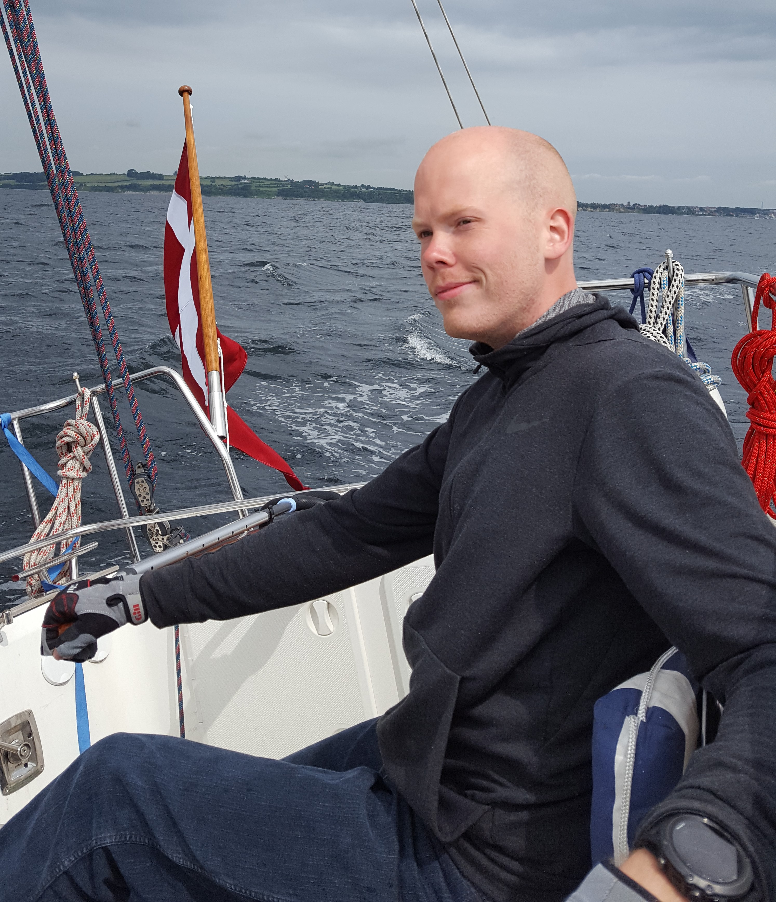

If you would prefer the PDF version of my CV, please click <a href="files/hhjessen_CV.pdf" download>here</a>.

&nbsp;

###Educational Background

<first-column>
Feb 2016  
-Nov 2017
</first-column>

<second-column>
**MSc in Biology, Aarhus University**  
Specialized in aquatic ecosystems, trophic ecology, and modelling.  
Included three months of multidisciplinary fieldwork in western Tanzania, helping secure sustainable fishing in Lake Tanganyika.  
Experience communicating with stakeholder, politicians and citizens.  
Supplementary courses on ecosystem management.
</second-column>  

<first-column>
Aug 2012  
-Jan 2016
</first-column>

<second-column>
**BSc in Biology, Aarhus University**  
Including courses on multivariate analysis and GIS.  
Courses on experimental design, project theory, and protocol evaluation.
</second-column>

&nbsp;

###Work Experience

<first-column>
2018  
Jul - Nov
</first-column>

<second-column>
**Nature guide at The Wadden Sea Centre** (27 hours/week)  
Responsible for hosting guided tours in our exhibition, in the Wadden Sea National Park, as well as teaching and development of teaching material for a wide variety of levels.
</second-column>  

<first-column>
2016  
Jan - Jul
</first-column>

<second-column>
**Communicator for The Danish Vegetarian Association** (Part time)  
Hosting workshops aimed at teaching about the connection of anthropogenic consumption to climate changes, targeted at 6th to 9th grade level.
</second-column>

&nbsp;

###Courses  
<first-column>
2016  
Aug
</first-column>

<second-column>
**Ecopath w/ Ecosim** (30 hours)  
Week-long course on using this modelling software, given by developer Villy Christensen. Included theoretical background, practical case study, and building a hypothetical model for Lake Tanganyika, and Lake Volta.
</second-column>

&nbsp;

###IT skills {.tabset}  
####R  
<meta name="viewport" content="width=device-width, initial-scale=1">
<link rel="stylesheet" href="https://www.w3schools.com/w3css/4/w3.css">

  
90%

  
Routine user of the R software, it being my primary tool for data analysis and visualization. I am familiar with the syntax, function building, and able to quickly familiarize myself with new packages as needed.  
I am also a big proponent of RStudio, and have begun regularly using R-markdown for most of my writing and development tasks, such as this website.
&nbsp;

####LaTeX  
<meta name="viewport" content="width=device-width, initial-scale=1">
<link rel="stylesheet" href="https://www.w3schools.com/w3css/4/w3.css">

  
70%

  
Capable of creating visually pleasing reports, as well as other documents, using LaTeX. The PDF version of my CV, downloadable from the top of this page, is made using a mixture of Markdown and LaTeX within R-markdown.
&nbsp;

&nbsp;

####HTML/CSS  
<meta name="viewport" content="width=device-width, initial-scale=1">
<link rel="stylesheet" href="https://www.w3schools.com/w3css/4/w3.css">

  
40%

  
I am familiar with the basic syntax, and have created this website using mainly HTML and CSS, supplemented by Markdown within R-markdown. I am still taking courses to improve my skills in web design, hoping to be able to build more aesthetically pleasing websites.
&nbsp;

&nbsp;

####Ecopath  
<meta name="viewport" content="width=device-width, initial-scale=1">
<link rel="stylesheet" href="https://www.w3schools.com/w3css/4/w3.css">

  
40%

  
Knowledgeable on how the software functions, and enthusiastic about the applications that the model has for management of fisheries. I have previously helped created a conceptual model of Lake Tanganyika using EwE, and I am confident that I would quickly be able to efficiently utilize the software. 
&nbsp;

&nbsp;

####Python  
<meta name="viewport" content="width=device-width, initial-scale=1">
<link rel="stylesheet" href="https://www.w3schools.com/w3css/4/w3.css">

  
30%

  
Currently learning about the possibilities of Python, especially within data treatment and visualization, but I am currently more confident in R when performing these tasks. I am also interested in building simple web apps to simplify my workflow, and will be looking into this as my Python skills improve.  
&nbsp;

####MS Office  
<meta name="viewport" content="width=device-width, initial-scale=1">
<link rel="stylesheet" href="https://www.w3schools.com/w3css/4/w3.css">

  
100%

  
Very practiced in Word, Excel and Powerpoint, having routinely used all programs throughout my university years to a large extent. Despite being largely fluent in all the programs, I now aim towards independence from the software, and prefer to do as much of my work within RStudio as possible.
&nbsp;

&nbsp;

###Additional experience
<first-column>
2015-2018
</first-column>

<second-column>
**Chairman for the board game association at my dormitory**  
Planning, promoting and hosting events  
Responsible for calling meetings and assembleys  
Applying for funds
</second-column>  

<first-column>
2015-2017
</first-column>

<second-column>
**Volunteer at UNF Aarhus**  
Planning and hosting science lectures with external guests  
Delivering lectures on natural sciences at high school level  
Acting a a guide for high school students on larger projects
</second-column>  

<first-column>
2016
</first-column>

<second-column>
**Co-founder of a nature-club for families with small children**  
Planning and hosting outdoor activities, aimed at showing families ways to spend time in the outdoors, and developing an early interest for this in the children.
</second-column>

&nbsp;

###Language skills
<first-column>

</first-column>

<second-column>
Fluent in both verbal and written Danish, it being my national language.  
</second-column>  
&nbsp;

&nbsp;

<first-column>

</first-column>

<second-column>
Fluent in both verbal and written English, having been exposed to english media from a very early age, and having utilized it greatly throughout my studies.  
</second-column> 
&nbsp;

<first-column>

</first-column>

<second-column>
As a danish person, I am able to communicate with both Swedes and Norwegians, each using our own national languages, due to the similarities of the languages.  
</second-column>  
&nbsp;

<first-column>

</first-column>

<second-column>
Conversational in German, having been raised in southern Denmark, close to the Danish/German border, and recieving several years of German teaching during primary- and high school.  
</second-column>
  

&nbsp;

###Hobbies {.tabset}
####Tabletop games

I am fond of playing board games, and I own an extensive collection. I play both classic games, such as Chess and Go, as well as more modern games. I regularly get together with friends to play, and find it to be an excellent way to spend time together. I also regularly play tabletop roleplaying games, such as Dungeons and Dragons.
&nbsp;

&nbsp;

&nbsp;

&nbsp;

####Strength training

I care about my physical well being, and lifting weights is my sport of choice. I visit my local gym several times per week, aiming to improve my health and looks. For me, it is also a social thing, as I have friends who attend the gym with me, which helps motivate me when I have an off day.
&nbsp;

&nbsp;

&nbsp;

&nbsp;

&nbsp;

####Photography

I enjoy capturing landscapes and wildlife while in the field. I would thrive in a job that includes frequent travel, as I would love the opportunity to visit more exotic places around the world, of course with my camera in tow. If you would liketo see some of my photos, feel free to visit my 500px site <a href="https://500px.com/sjujimako">here</a>.

&nbsp;

&nbsp;

&nbsp;

&nbsp;

####Sailing

Denmark is an excellent country for sailors. I was raised in a family of sailors, which has made it's mark. I try to get as much sailing done as possible in the summer months. I competed in local sailing competitions throughout my high school days, but have not had the same access to sailing equipment after moving for my education. 
&nbsp;

&nbsp;

&nbsp;

&nbsp;

&nbsp;

####Skiing

Skiing is my favorite outdoor activity, however, living in Denmark does not afford one many opportunities to practice. I try to get in at least one skiing trip per year when possible, and have been doing so since the age of 6. 
&nbsp;

&nbsp;

&nbsp;

&nbsp;

&nbsp;

&nbsp;

###References  
Peter Grønkjær - Associate Professor, AU  
Supervisor during my thesis work  
peter.groenkjaer@bios.au.dk  
+45 23 38 21 77  
<a href="files/hhjessen_letter_of_recommendation_grønkjær.pdf" download>Letter of recommendation (.pdf)</a>.  

Torben L. Lauridsen - Senior Scientist, AU  
Supervisor during my thesis work  
tll@bios.au.dk  
+45 25 15 15 27  
<a href="files/hhjessen_letter_of_recommendation_lauridsen.pdf" download>Letter of recommendation (.pdf)</a>.