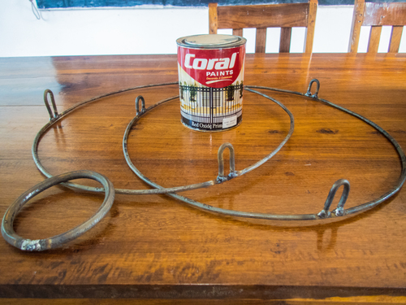
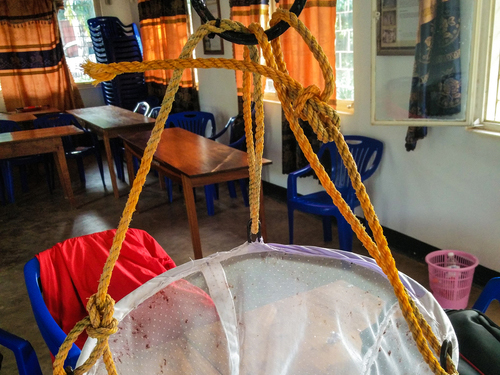
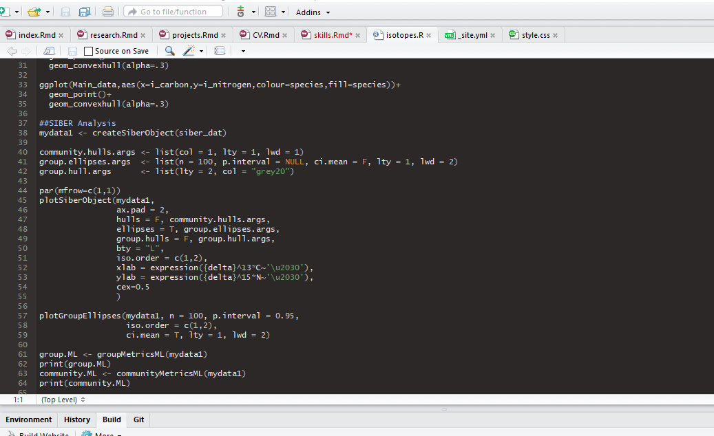
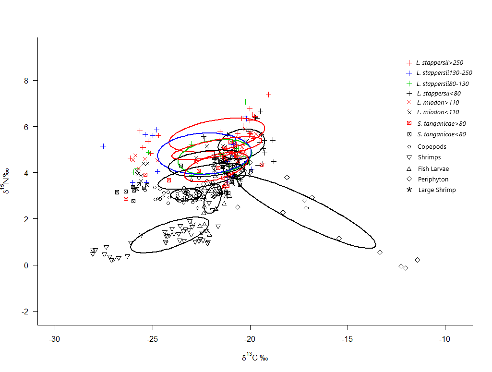

<meta name="viewport" content="width=device-width, initial-scale=1">
<link rel="stylesheet" href="https://www.w3schools.com/w3css/4/w3.css">
<style>
.mySlides {display:none;}
</style>

###Overview  
```{r Web chart, echo=FALSE, message=FALSE, warning=FALSE}
library("fmsb")

df <- data.frame()
df=rbind(rep(10,6) , rep(0,6) , df)
df[3,1] <- 10
df[3,2] <- 9
df[3,3] <- 8
df[3,4] <- 7
df[3,5] <- 10
df[3,6] <- 7
colnames(df) <- c("Field Work", "Lab Work", "Data Science", "Stable Isotope Analysis", "Stomach Analysis", "Otolithometry")

par(mar=c(0,2,0,2))
radarchart(df, axistype = 0, maxmin=T, pcol = "navy", cglty = 1, cglcol = "gray")
```


### Field work

<section>
<div class="w3-content w3-display-container" style="float: right; width: 400px; margin-left: 30px">
  
  
  
  
  
  
  
  
  
  <button class="w3-button w3-black w3-display-left" onclick="plusDivs(-1)">&#10094;</button>
  <button class="w3-button w3-black w3-display-right" onclick="plusDivs(1)">&#10095;</button>
</div>
As part of my master's thesis, I spent 3 months in Kigoma, Tanzania, conducting field work in Lake Tanganyika. Staying/Working in a developing nation presents challenges, which in turn requires creativity and quick thinking. My best example of this is the net shown in the picture to the right: the zooplankton net that I had originally brought from Denmark was lost, due to a faulty rope. However, we managed to construct the net shown in the picture using various components found in the local market (the mesh itself is made of bride's veil), which adequately allowed us to finish our samplings. To see more images from the construction, feel free to browse through the pictures on the right.
</section>

<br>

### Lab work

<section>

Throughout my projects and my thesis work, I have spent countless hours in the lab. Most of these hours were in the Marine Ecology lab at Aarhus University, but I have also worked in the Tanzanian Fisheries Research Institute in Kigoma, and aboard the RV Aurora with Aarhus university. Tasks included zooplankton identification, stomach analysis, stable isotope analysis, fish dissections, otolithometry and more. For more information, feel free to get in touch with me to discuss specific methods further.
</section>

<br>

<br>

### Data Science

<section>

During my coursework, I was tought on statistical analysis, multivariate analysis, as well as the basics of modelling and GIS. Afterwards, I have worked to expand my skills within this field, mainly within the **R** environment, although I have recently started learning Python as well. I continue to spend my free time undertaking courses on data science and machine learning, and hope to be able to apply these skills to ecosystem modelling research in the future.
</section>

<br>

<br>


### Stable Isotope Analysis

<section>

The backbone of my master's thesis was the utilization of &delta;^13^C and &delta;^15^N isotopes to estimate the pelagic food web of Lake Tanganyika, East Africa. The preparation involved dissecting individuals, drying of samples, packaging and shipping. Analysis was based on both visual estimation from the isotope biplot (right), comparison with a supplementary stomach analysis, bayesian modelling using MCMC-Dirichlet in the SIAR package for **R**, and standard ellipse overlap, calculated using the SIBER package for **R**. 
</section>

<br>

<br>

### Stomach analysis

<section>

Stomach analysis has been a part of two of my projects: first a 10 ECTS project on sandeel diets based on sandeel stomachs from western Greenland; secondly as part of my thesis work, estimating trophic interactions in Lake Tanganyika. This work has given me transferable skills in zooplankton taxonomy of these systems, as most of the work consisted of identification. It has also provided me with an excellent understanding of energetics, and rudimentary data analysis.
</section>

<br>

<br>

### Otolithometry

<section>

As part of my thesis work, and a project on which i now collaborate, we have used daily ring counts in saggitae otoliths from the three commercially important pelagic fish species from Lake Tanganyika to estimate age and growth, aiming to register differences in growth between the wet and dry seasons in the area. This work has given me an understanding of otolith chemistry, as well as practical experience preparing otoliths for analysis, and estimating age based on ring counts.  
</section>


<script>
var slideIndex = 1;
showDivs(slideIndex);

function plusDivs(n) {
  showDivs(slideIndex += n);
}

function showDivs(n) {
  var i;
  var x = document.getElementsByClassName("mySlides");
  if (n > x.length) {slideIndex = 1} 
  if (n < 1) {slideIndex = x.length} ;
  for (i = 0; i < x.length; i++) {
    x[i].style.display = "none"; 
  }
  x[slideIndex-1].style.display = "block"; 
}
</script>